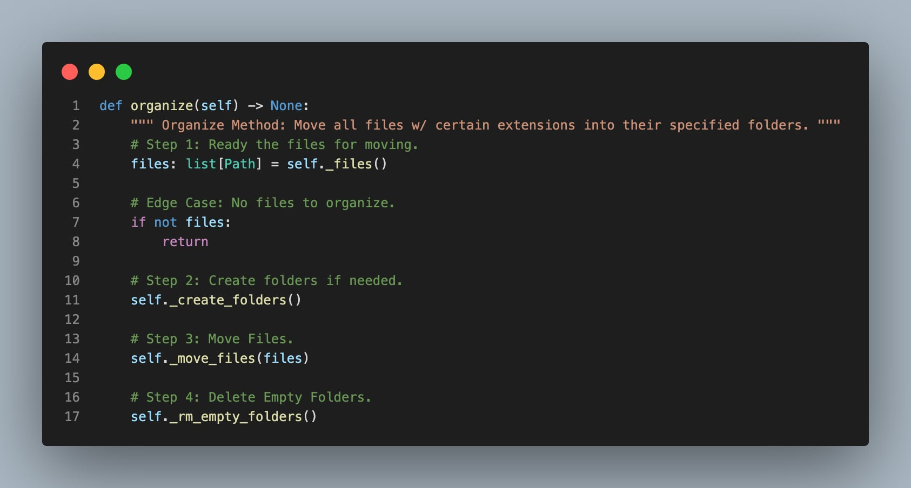

# Unix File Organization

## Description:
This is the base for a file organization app with the purpose of moving files present within the root of a "starting" directory to a "final" directory; 
whether it be that "final" directory's root or to automatically created sub-folders within it. The "starting" and "final" directories supplied can be
 the same due to this.

The process starts with the program searching for potential files to move. Whether a file is considered to be "movable" depends on its format type 
(i.e audio), which is determined by its extension (i.e mp3, wav, etc.) If any movable files are found, the program looks for a list of supplied folder 
names tied to existing format types and creates said folders on the "final" directory's root if they don't already exist. The files are then moved 
either into the "final" directory's root or an aforementioned sub-folder within that directory if it is tied to the file's format type (for example, 
there may be a folder specifically for audios). Once the process is complete, all empty folders within the "final" directory are deleted and the 
user is left with their files successfully organized. All steps below are their own methods and their combination allows for this organization process.

### Steps:
1) Search the "starting" directory for potential files to move. Stop if none are found.
2) If supplied by the user, create new empty folders on the "final" directory's root that are tied to format types, if they don't already exist.
3) Move files based on their format types. They may be moved to either the "final" directory's root or a sub-folder tied to the said format type.
4) Delete all empty folders on the "final" directory. Process complete!

## app -> organize:
Where all 

### Formats
hi
### OrganizeDirectory
hi

## OrganizeDirectory Class:

## Programming Concepts Used:

## Testing + Logging

## Containerization
